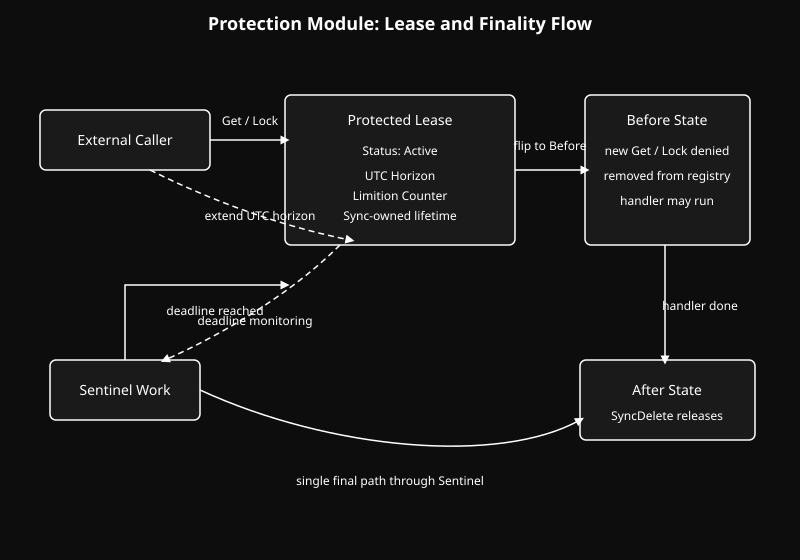

  <a href="../readme.md" style="color: #fff;">Back to Sync</a>

# Sync Protection Module

Time-based and count-based lifecycle protection built on the Sync module.

## Architecture

  

## Overview
The Protection module extends Sync with lease-based lifetime control.

Where Sync provides reference-counted ownership and safe destruction hooks, Protection adds two external boundaries to a resource:

- Time: a UTC expiration horizon
- Count: a quantitative limit

Together, these boundaries define a protected lease. A protected object may still be shared through the Sync model, but its continued
existence is now constrained by explicit policy rather than reference flow alone.

## Design
Protection is built around a small set of lifecycle rules:

- A protected object begins in an active state
- The lease may be extended, but only when the change is meaningful
- Expiration is enforced by a worker that re-checks the current deadline before acting
- Teardown is routed through one execution path
- The object becomes unavailable before final cleanup completes

This keeps the base Sync model intact while adding a stricter outer boundary around when a resource may still be acquired and when it must
begin leaving the system.

## Lifecycle
### 1. Lease
Each protected object carries:

- A UTC deadline
- A limit counter
- A handler for final teardown

The lease lives with the object. It does not merely describe the object from the outside. It participates in deciding whether the object
remains available.

### 2. Horizon
The deadline may move forward when a caller presents a newer UTC horizon. Small changes are ignored through a 5-second filter so the worker
queue is not constantly rescheduled for meaningless jitter.

This allows the lease to stay adaptive without turning scheduler activity into noise.

### 3. Sentinel
A delayed work item acts as the Sentinel for expiration.

When it wakes, it does not assume the stored deadline is still final. It compares the lease horizon against current time. If the deadline was
pushed forward while the worker slept, the worker reschedules itself and returns. Expiration proceeds only when the horizon has actually been
reached.

### 4. Transition
When expiration begins, the protected object leaves the active state before cleanup is finished.

At that point, new `Get` and `Lock` attempts are rejected. Existing holders still complete through the underlying Sync model, but new entry is
cut off. This creates a shielded transition between active use and final cleanup.

### 5. Finality
Timeout, limit exhaustion, and explicit delete requests all converge on the same worker path.

That path invokes the final handler once, removes the object from the Protection registry, and then releases the Protection-owned Sync
reference. The underlying Sync hooks remain responsible for draining outstanding holders and reclaiming memory safely.

## Result
Protection is not a replacement for Sync. It is a stricter policy layer on top of it.

Sync answers: "is this object still safely owned?"

Protection adds: "is this object still allowed to remain alive?"

That distinction is the value of the module. It gives shared objects a lease, gives expiration a single execution path, and gives teardown a
clean boundary between active visibility and final release.

