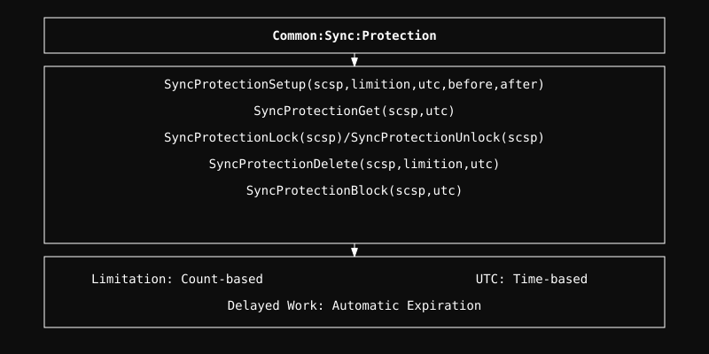

# Sync Protection Module

Extends the Sync framework with time-based and count-based access control.

## Architecture

  

## Overview
The Sync Protection module provides advanced lifecycle management by adding expiration (UTC) and usage limits (limitation). It uses delayed work to automatically handle expiration and ensures that objects are only accessible while they are within their allowed usage quotas and time windows.

