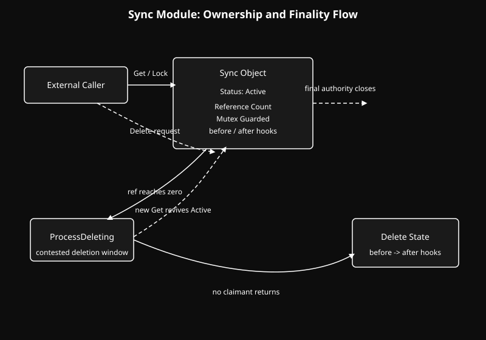

  <a href="../readme.md" style="color: #fff;">Back to Common</a>

# Sync Module

A reference-counted ownership and finality framework built on Linux kernel mutexes.

## Architecture

  

  <b>Navigate to Submodules:</b> 
  <a href="Protection/readme.md" style="color: #fff;">Protection</a>

## Overview
The Sync module exists to decide whether an object still belongs to the living system.

It establishes a compact law of ownership:

- an object may be actively held
- an object may be challenged by deletion
- an object may be restored if ownership returns in time
- an object may cross into irreversible finality

Sync is deliberately narrow. It does not try to describe policy, scheduling, or higher-order lifetime rules. It answers a more fundamental
question:

Who still has the right to keep this object alive?

The answer is expressed through three states:

- `Active`
- `ProcessDeleting`
- `Delete`

These states define more than control flow. They define the boundary between possession, contested deletion, and final removal.

## State Model
### 1. Active
`Active` is the state of lawful ownership.

In this state, holders may enter, the reference count may grow, and the object remains part of the live system. Deletion may be requested,
but as long as ownership still exists, finality has no authority yet.

### 2. ProcessDeleting
`ProcessDeleting` is the contested boundary.

This is the most important idea in Sync.

When ownership falls to zero, Sync does not immediately declare the object dead. It enters a guarded middle state where deletion is in
motion, but not yet sovereign.

If ownership returns during this phase, the object is restored to `Active`. Deletion is canceled. The system acknowledges a new claim and
allows life to continue.

### 3. Delete
`Delete` is final authority.

If no new holder returns during `ProcessDeleting`, the object crosses into `Delete`. After that:

- new entry is denied
- ownership is no longer revivable
- the destruction hooks execute in order: `before`, then `after`

At this point, deletion is no longer pending. It has won.

## Execution Flow
Sync is built around a short but decisive sequence:

1. `Setup` initializes the mutex, state, reference count, and optional hooks.
2. `Get` enters under lock, restores from `ProcessDeleting` if needed, and records a new claim.
3. `Delete` decrements the reference count.
4. When ownership reaches zero, Sync enters `ProcessDeleting`.
5. If a new claimant appears, the object returns to `Active`.
6. If no claimant returns, Sync commits to `Delete` and runs the destruction hooks.

This two-step delete path is the heart of the module. A plain reference counter treats zero as an ending. Sync treats zero as a challenge.

Zero means: deletion may begin.

`Delete` means: deletion has won.

That gap is where the module earns its value. It gives the system one narrow interval in which ownership may return, premature destruction
may be avoided, and finality is granted only when no legitimate claimant remains.

## Usage
The `SyncLock` macro includes an `if` statement for compact error handling (e.g., `SyncLock(scs)return;`).

