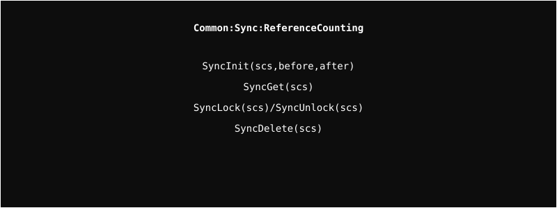

# Sync Module

A reference-counted synchronization framework built on Linux kernel mutexes.

## Architecture

  

## Overview
The Sync module handles object lifecycles through reference counting. It prevents use-after-free errors and ensures safe object destruction by allowing hooks (`before` and `after`) to be called when the reference count reaches zero.

