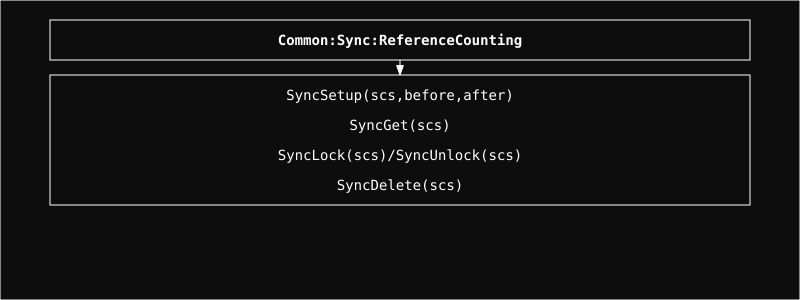

  <a href="../readme.md" style="color: #fff;">Back to Common</a>

# Sync Module

A reference-counted synchronization framework built on Linux kernel mutexes.

## Architecture

  

  <b>Navigate to Submodules:</b> 
  <a href="Protection/readme.md" style="color: #fff;">Protection</a>

## Overview
The Sync module handles object lifecycles through reference counting. It prevents use-after-free errors and ensures safe object destruction by allowing hooks (`before` and `after`) to be called when the reference count reaches zero.

## Usage
The `SyncLock` macro includes an `if` statement for compact error handling (e.g., `SyncLock(scs)return;`).

