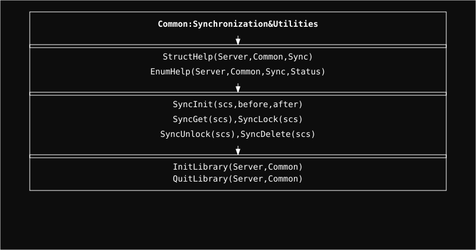

  <a href="../readme.md" style="color: #fff;">Back to Server</a>

# Common Module

Shared lifecycle and utility foundations used across the Server project.

## Architecture

  

  <b>Navigate to Submodules:</b> 
  <a href="Sync/readme.md" style="color: #fff;">Sync</a> | 
  <a href="Sync/Protection/readme.md" style="color: #fff;">Protection</a>

## Overview
The Common module is the base layer for reusable ownership and lifecycle mechanics inside the Server tree.

At the moment, its primary responsibility is to host Sync and its extensions. That makes Common the place where shared object lifetime rules
begin before higher layers add policy, hardware behavior, or domain-specific logic.

## Structure
- `Sync/`: the ownership and finality layer
- `Sync/Protection/`: lease-based lifetime control built on top of `Sync`

## Role
Common stays intentionally small.

It is not the place where storage, network, or protocol behavior is decided. Its job is to provide lower-level mechanisms that other parts
of the system can trust and build on. In this structure:

- `Common` defines shared foundations
- `Sync` governs ownership and contested deletion
- `Protection` upgrades Sync with time and count boundaries

