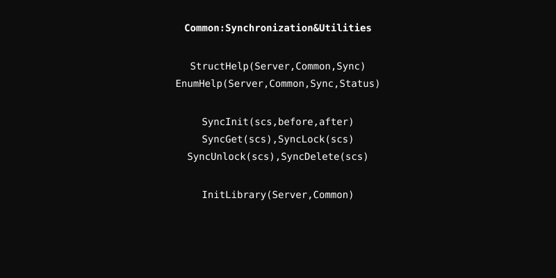

# Common Module

Shared resources and utilities used across the Server project.

## Architecture

  

## Submodules

### Sync
A reference-counted synchronization framework using mutexes. It ensures safe object deletion by tracking active references and providing initialization/cleanup hooks.

- **SyncInit**: Initialize synchronization object.
- **SyncGet**: Increment reference count.
- **SyncLock/Unlock**: Safe mutex operations.
- **SyncDelete**: Decrement count and trigger cleanup if zero.

