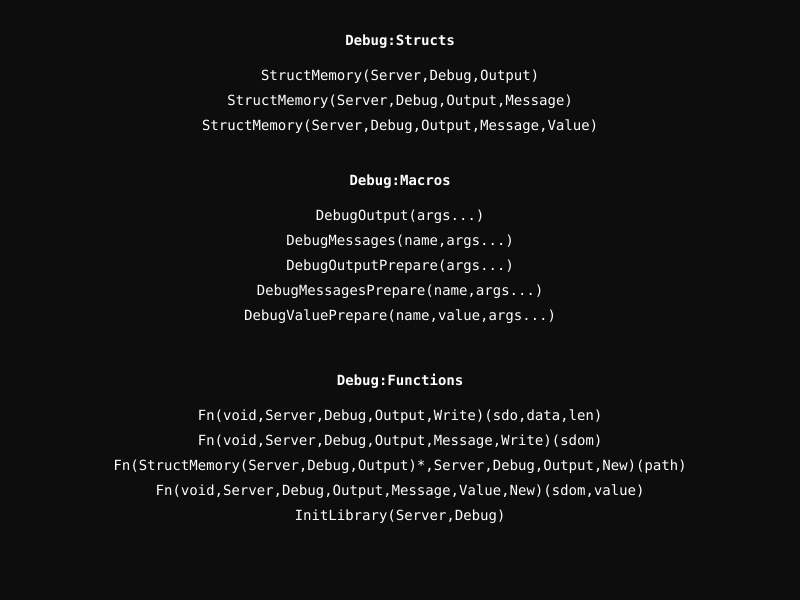

# Debug Module

A custom real-time logging framework that writes directly to the kernel filesystem.

## Debug Architecture

  

## Overview
The module provides a layered approach to logging:
1. **Output**: Represents a file on disk.
2. **Message**: A unique category within a log file.
3. **Value**: The actual data logged under a message category.

## Core Macros
- `DebugOutput(args...)`: Defines a static output handle.
- `DebugMessages(name,args...)`: Defines a static message handle.
- `DebugValuePrepare(name,value,args...)`: Logs a value to the specified message.
