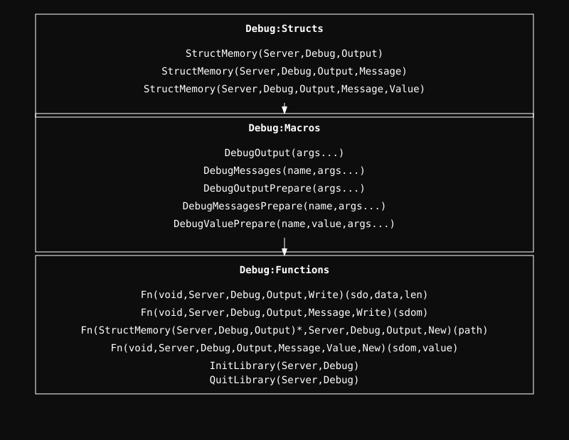

  <a href="../readme.md" style="color: #fff;">Back to Server</a>

# Debug Module

A custom real-time logging framework that writes directly to the kernel filesystem.

## Debug Architecture

  

## Overview
The module provides a layered approach to logging, allowing for organized real-time tracing of kernel events.

- **Output**: Represents a log file on disk.
- **Message**: A unique category within a log file.
- **Value**: Data logged under a message category.

