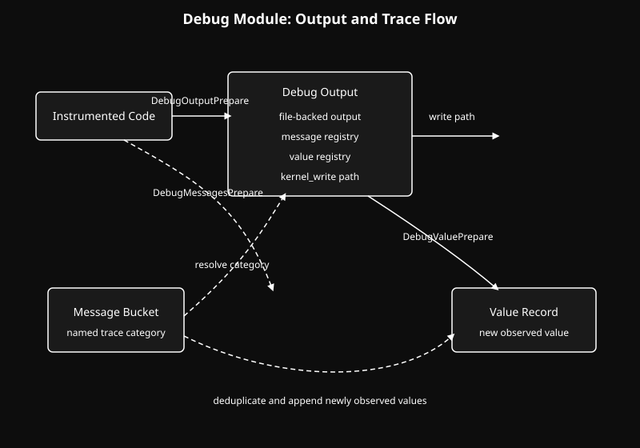

  <a href="../readme.md" style="color: #fff;">Back to Server</a>

# Debug Module

A lightweight debug-output pipeline for structured kernel-side tracing.

## Architecture

  

## Overview
The Debug module turns repeated trace events into a small structured hierarchy:

- `Output`: a backing file
- `Message`: a named event category inside that output
- `Value`: a recorded value under that category

This gives the tree a reusable way to emit trace data without scattering raw file-writing logic everywhere.

## Flow
The module is built around a simple sequence:

1. `DebugOutputPrepare(...)` creates or opens an output target.
2. `DebugMessagesPrepare(name, ...)` resolves a named message bucket under that output.
3. `DebugValuePrepare(name, value, ...)` records a value under the message.

Internally, the module deduplicates outputs, messages, and values, then writes newly observed values to the backing file.

## Role
Debug is not a general logging framework with levels, transports, or formatting layers. It is a focused tracing utility for this tree:

- outputs are file-backed
- messages are explicit categories
- values are appended when first observed

That makes it useful for fast instrumentation while keeping the write path small and predictable.

