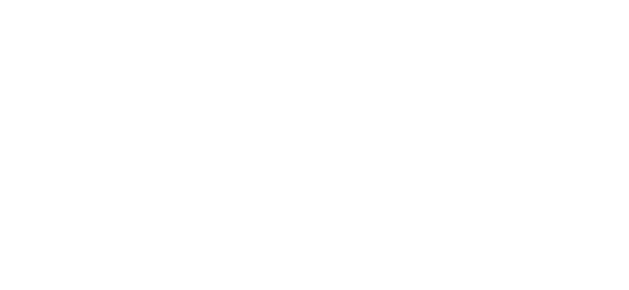

# Memory Module

Low-level memory pool management and allocation framework.

## Architecture

  

## Overview
The Memory module provides a standardized interface for allocating and deallocating memory blocks within the kernel. It uses a pool-based approach to ensure consistency and simplifies error handling through built-in null checks in its macros.

## Core Macros
- **MemoryPrepare**: Sets up a memory pool for a specific structure type.
- **MemoryGet**: Allocates memory for a structure and automatically performs a null check.
- **MemoryDelete**: Safely deallocates memory.

