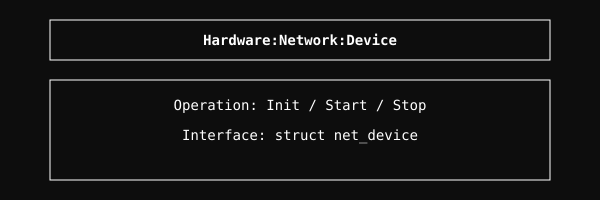

# Hardware Network Device Module

Low-level interface for physical network devices.

## Architecture

  

## Overview
The Hardware Network Device module provides a unified interface for physical NICs. It handles low-level initialization, state management, and basic transmission/reception primitives for various hardware adapters.

