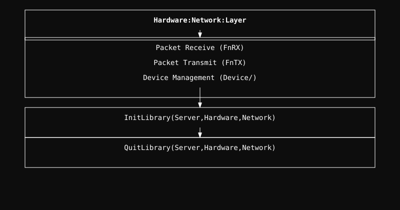

  <a href="../readme.md" style="color: #fff;">Back to Hardware</a>

# Hardware Network Module

Low-level drivers and hardware interface for network controllers.

## Architecture

  

  <b>Navigate to Submodules:</b> 
  <a href="Device/readme.md" style="color: #fff;">Device</a>

## Overview
This module implements the direct interaction with the networking hardware. It provides the base layer for sending and receiving raw sk_buffs.

## Project Structure

- **Device/**: Unified interface for physical network adapters.

