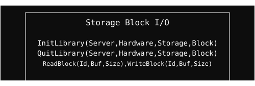

  <a href="../readme.md" style="color: #fff;">Back to Storage</a>

# Block Module

Low-level I/O operations for storage hardware.

## Architecture

  

## Overview
Handles raw data blocks, DMA transfers, and sector-level access. It provides the foundation for higher-level storage operations.

