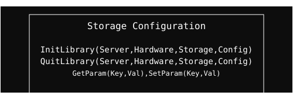

  <a href="../readme.md" style="color: #fff;">Back to Storage</a>

# Config Module

Management of storage parameters and device configuration.

## Architecture

  

## Overview
Handles persistence and validation of hardware settings. It ensures that storage devices are correctly initialized according to the system's requirements.

