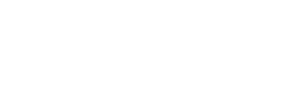

  <a href="../readme.md" style="color: #fff;">Back to Storage</a>

# Delete Module

Safe removal of storage resources and cleanup.

## Architecture

  

## Overview
Handles the deallocation and safe shutdown of storage components to prevent data loss or resource leaks.

