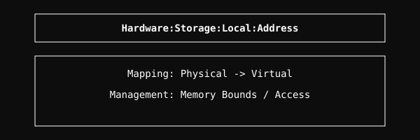

  <a href="../readme.md" style="color: #fff;">Back to Local</a>

# Address Module

Addressing schemes for local storage devices.

## Architecture

  

## Overview
Defines and manages the addressing logic for local storage blocks and files.

