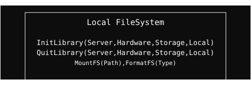

  <a href="../readme.md" style="color: #fff;">Back to Storage</a>

# Local Storage Module

Local filesystem management, mounting, and formatting.

## Architecture

  

  <b>Navigate to Submodules:</b> 
  <a href="Address/readme.md" style="color: #fff;">Address</a>

## Overview
Handles mounting, formatting, and file-level access on local storage media. It provides a standardized interface for interacting with various local storage devices.

