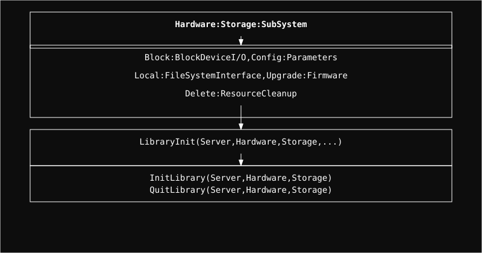

# Storage Module

Management of storage devices, block I/O, and local data persistence.

## Architecture

  

  <a href="Block/readme.md" style="color: #fff;">Block</a> | 
  <a href="Config/readme.md" style="color: #fff;">Config</a> | 
  <a href="Delete/readme.md" style="color: #fff;">Delete</a> | 
  <a href="Local/readme.md" style="color: #fff;">Local</a> | 
  <a href="Upgrade/readme.md" style="color: #fff;">Upgrade</a>

## Submodules

### Block
Handles low-level block device operations and requests.

### Config
Manages storage-specific configurations and parameters.

### Delete
Handles safe removal of storage resources and cleanup.

### Local
Interface for local storage management and data access.

### Upgrade
Logic for upgrading storage components or firmware.

