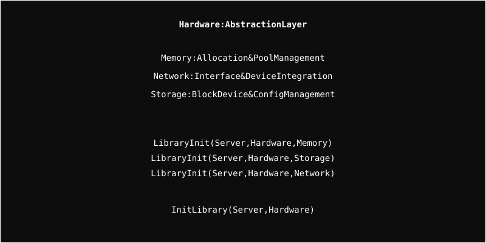

# Hardware Module

Low-level abstractions for system memory, networking hardware, and storage devices.

## Architecture

  

## Submodules

### Memory
Manages kernel memory pools and provides a consistent interface for object allocation and deletion.

### Network
Handles network interface controllers (NICs) and integrates them with the higher-level OSI stack.

### Storage
Provides abstractions for block devices, local storage, and configuration management across different storage types.

