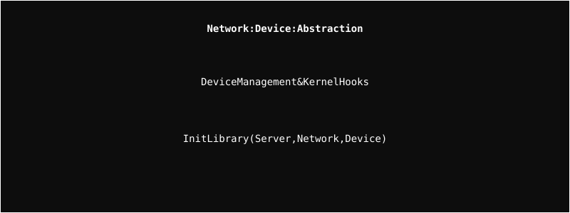

# Network Device Module

Abstractions for physical and virtual network devices.

## Architecture

  

## Overview
This module handles the lifecycle of network devices within the server. It provides the necessary hooks for the Linux kernel to interact with your custom network stack.

