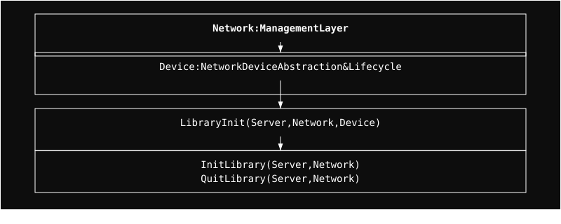

# Network Module

High-level management of network devices and integration with the Linux networking stack.

## Architecture

  

  <a href="Device/readme.md" style="color: #fff;">Device</a>

## Submodules

### Device
Manages the lifecycle and configuration of virtual and physical network devices. It serves as the primary interface between the hardware-specific drivers and the OSI protocol stack.

