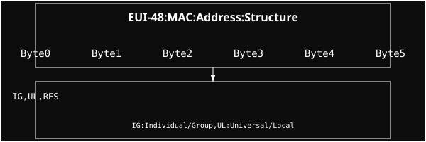

# EUI-48 (MAC Address)

Structure for handling 48-bit Ethernet addresses (MAC addresses).

## Structure Layout

| Byte | Bits | Name | Description |
| :--- | :--- | :--- | :--- |
| **0** | 0 | **IG** | Individual/Group bit. 0: Unicast, 1: Multicast/Broadcast. |
| **0** | 1 | **UL** | Universal/Local bit. 0: Universal (OUI), 1: Locally administered. |
| **0** | 2-7 | **RES** | Remaining part of the first byte. |
| **1-5** | - | **Bytes** | The remaining 5 bytes of the address. |

## Detailed Definitions

### EUI-48
The Extended Unique Identifier 48 (EUI-48) is a unique identifier assigned to a network interface controller (NIC) for use as a network address in communications within a network segment. It is commonly referred to as a MAC (Media Access Control) address.

### IG (Individual/Group) Bit
The least significant bit of the first byte of the address is used to distinguish between unicast and multicast addresses:
*   **0 (Individual):** The address refers to a single network interface.
*   **1 (Group):** The address refers to a group of network interfaces (multicast or broadcast). For example, IPv6 multicast addresses always start with a byte where this bit is set (like `33:33`).

### UL (Universal/Local) Bit
The second least significant bit of the first byte of the address indicates how the address was assigned:
*   **0 (Universal):** The address is globally unique and was assigned by the manufacturer (using their OUI - Organizationally Unique Identifier).
*   **1 (Local):** The address is locally administered. This is commonly seen in virtualized environments (like VMs or Docker containers) or when a MAC address has been manually overridden by a network administrator.
