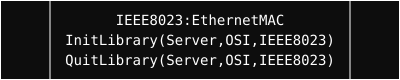

  <a href="../readme.md" style="color: #fff;">Back to OSI</a>

# IEEE 802.3 (Ethernet)

Implementation of the IEEE 802.3 standard for Ethernet framing.

## Architecture

  

## Overview
Handles the construction and parsing of Ethernet frames, including header management and payload encapsulation.

