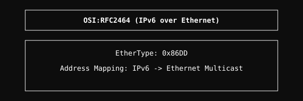

  <a href="../readme.md" style="color: #fff;">Back to OSI</a>

# RFC 2464 (IPv6 over Ethernet)

Transmission of IPv6 packets over Ethernet networks.

## Architecture

  

## Overview
Specifies the method for encapsulating IPv6 packets within Ethernet frames and handling the associated multicast mapping.

