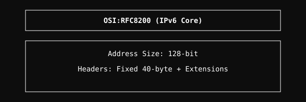

# RFC8200 Module

Implementation of Internet Protocol version 6 (IPv6) Specification.

## Architecture

  

## Overview
The RFC8200 module implements the core IPv6 protocol. It handles packet routing, header parsing, extension headers, and fragmentation for the next generation of the Internet Protocol.

