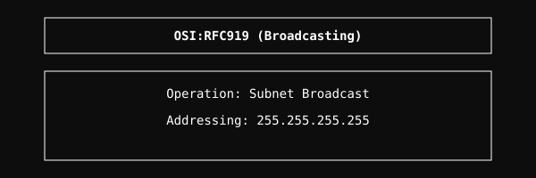

# RFC919 Module

Implementation of Broadcasting Internet Datagrams.

## Architecture

  

## Overview
The RFC919 module handles the broadcasting of IP datagrams within local networks. It ensures that broadcast packets are correctly addressed and distributed to all hosts on a subnet.

