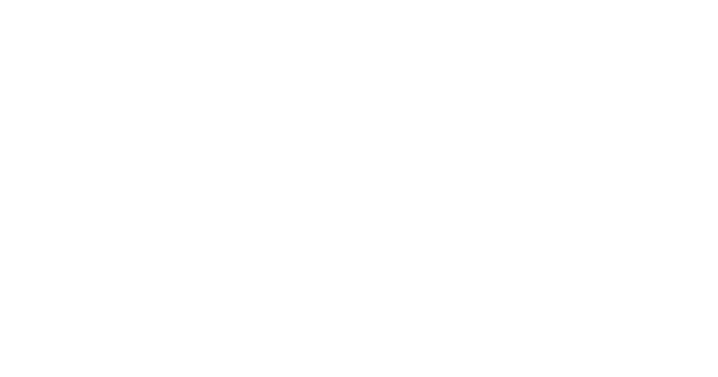

  <a href="../readme.md" style="color: #fff;">Back to Server</a>

# OSI Module

Implementation of networking protocols organized by layers.

## Architecture

  

  <b>Navigate to Submodules:</b> 
  <a href="EUI48/readme.md" style="color: #fff;">EUI48</a> | 
  <a href="IEEE8023/readme.md" style="color: #fff;">IEEE8023</a> | 
  <a href="RFC2464/readme.md" style="color: #fff;">RFC2464</a> | 
  <a href="RFC8200/readme.md" style="color: #fff;">RFC8200</a> | 
  <a href="RFC826/readme.md" style="color: #fff;">RFC826</a> | 
  <a href="RFC919/readme.md" style="color: #fff;">RFC919</a>

## Overview
This module organizes networking protocols into logical layers, from low-level Ethernet addressing to high-level internet protocols.

