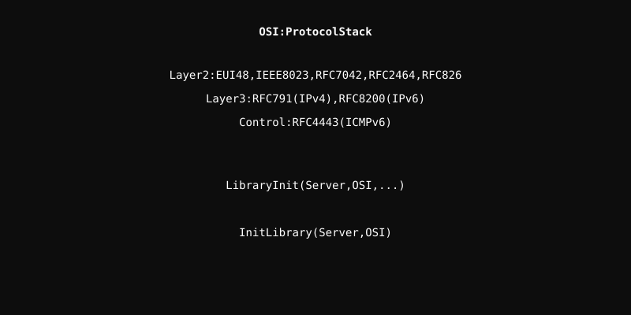

# OSI Module

Implementation of the networking protocol stack following the Open Systems Interconnection model.

## Architecture

  

  <a href="EUI48/readme.md" style="color: #fff;">EUI48</a> | 
  <a href="IEEE8023/readme.md" style="color: #fff;">IEEE8023</a> | 
  <a href="RFC7042/readme.md" style="color: #fff;">RFC7042</a> | 
  <a href="RFC2464/readme.md" style="color: #fff;">RFC2464</a> | 
  <a href="RFC791/readme.md" style="color: #fff;">RFC791</a> | 
  <a href="RFC8200/readme.md" style="color: #fff;">RFC8200</a> | 
  <a href="RFC826/readme.md" style="color: #fff;">RFC826</a> | 
  <a href="RFC4443/readme.md" style="color: #fff;">RFC4443</a>

## Overview
This module organizes networking protocols into logical layers, from low-level Ethernet addressing to high-level internet protocols.

