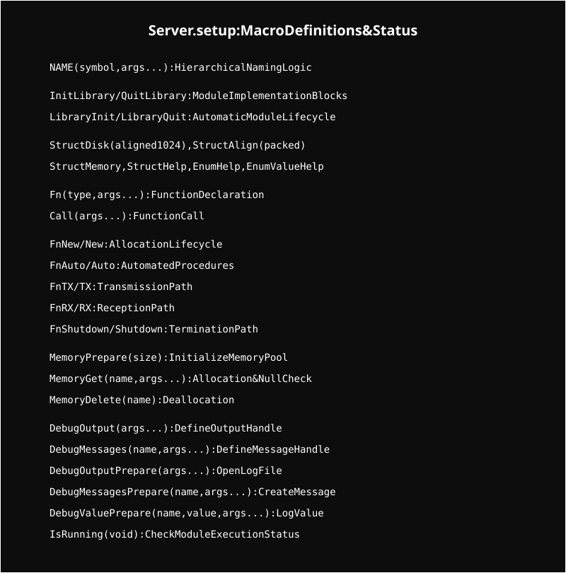
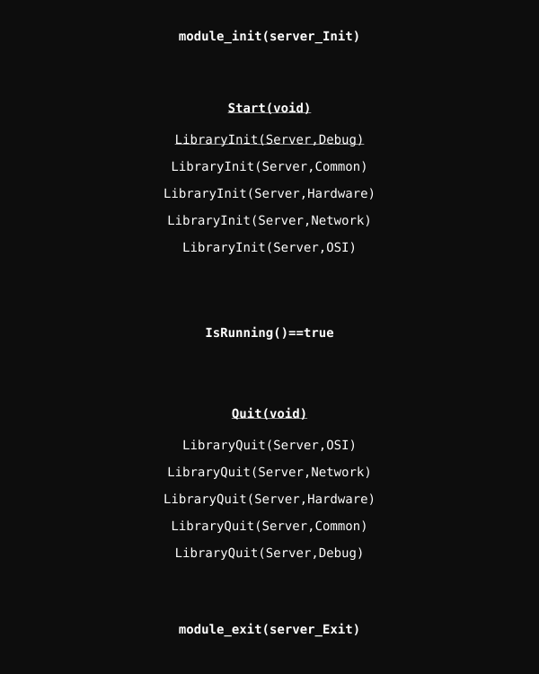

# Server Kernel Module

A custom Linux kernel module for high-performance network processing and hardware management.

## System Architecture

The core of the system is built on a highly compact macro-based naming convention and a layered initialization sequence.

### Setup & Macro Layer
The fundamental naming, memory management, and debugging facilities are unified in `.setup`.

  

### Initialization Flow
The system follows a strict layer-by-layer initialization order (and reverse de-initialization) managed in `main.c`.

  

## Project Structure

- **Debug/**: Custom logging framework.
- **Common/**: Shared resources and utilities.
- **Hardware/**: Low-level drivers for Memory, Network, and Storage.
- **Network/**: Integration with Linux networking stack.
- **OSI/**: Implementation of networking protocols.
