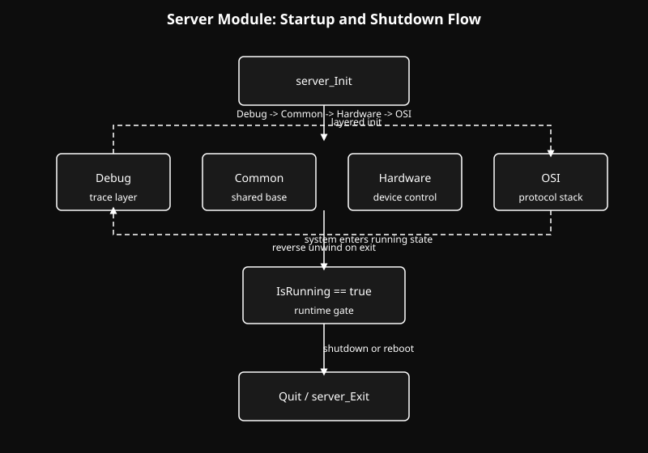

# Server Kernel Module

A layered kernel module for shared infrastructure, debugging, hardware control, and protocol processing.

  <b>Navigate to Submodules:</b> 
  <a href="Common/readme.md" style="color: #fff;">Common</a> | <a href="Debug/readme.md" style="color: #fff;">Debug</a> | <a href="Hardware/readme.md" style="color: #fff;">Hardware</a> | <a href="OSI/readme.md" style="color: #fff;">OSI</a>

## Overview
The Server module is the root of the project. It does not contain one isolated subsystem. It coordinates the full runtime stack:

- `Debug` for structured tracing
- `Common` for shared lifecycle foundations
- `Hardware` for device and storage control
- `OSI` for protocol behavior

Its main role is to establish startup order, maintain the running-state gate, and unwind the system cleanly during shutdown or reboot.

## Architecture
The system is built on two top-level foundations:

- the macro and setup layer in `.setup`
- the runtime init/quit flow in `main.c`

### Setup & Macro Layer
The naming system, memory helpers, debug interfaces, and shared module includes are centralized in `.setup`.

  

### Initialization Flow
The runtime follows a strict layer-by-layer initialization path, then unwinds in reverse order.

  

## Runtime Flow
From `main.c`, the top-level flow is:

1. register reboot handling
2. initialize `Debug`
3. initialize `Common`
4. initialize `Hardware`
5. initialize `OSI`
6. keep the module in the running state until shutdown
7. unwind in reverse order when the module exits or the system reboots

That ordering gives the project a stable base: lower-level services come up first, higher-level behavior comes later, and teardown follows the
same structure in reverse.

## Structure
- `Debug/`: structured trace and output pipeline
- `Common/`: shared foundations and ownership mechanics
- `Hardware/`: memory, network, and storage control
- `OSI/`: protocol and packet-processing layers

