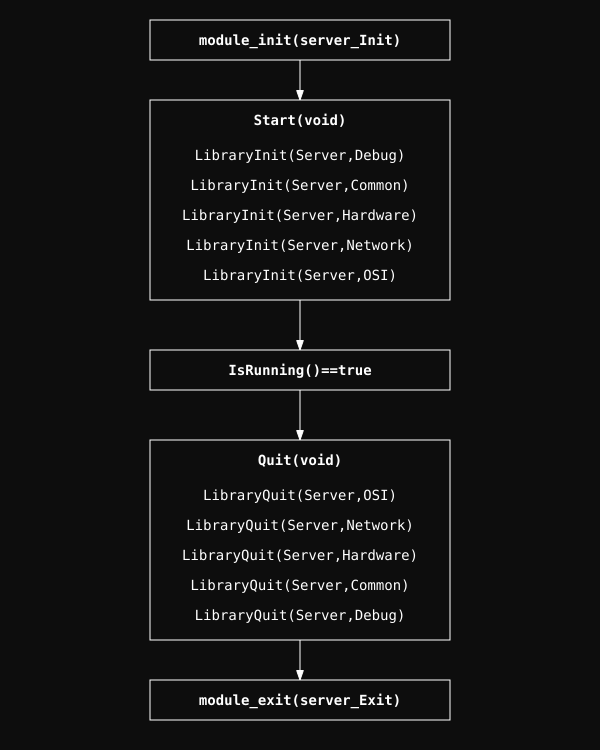

# Server Kernel Module

A custom Linux kernel module for high-performance network processing and hardware management.

## System Architecture

The core of the system is built on a highly compact macro-based naming convention and a layered initialization sequence.

### Setup & Macro Layer
The fundamental naming, memory management, and debugging facilities are unified in `.setup`.

  

### Initialization Flow
The system follows a strict layer-by-layer initialization order (and reverse de-initialization) managed in `main.c`.

  

  <b>Navigate to Modules:</b> 
  <a href="Debug/readme.md" style="color: #fff;">Debug</a> | 
  <a href="Common/readme.md" style="color: #fff;">Common</a> | 
  <a href="Hardware/readme.md" style="color: #fff;">Hardware</a> | 
  <a href="Network/readme.md" style="color: #fff;">Network</a> | 
  <a href="OSI/readme.md" style="color: #fff;">OSI</a>

## Packet Handling Life-cycle

- **FnNew**: An automatic process that creates the packet, identifies its structure, and places everything in the right spot.
- **FnRX**: Handles data coming into the system from the network.
- **FnTX**: Final instance for small corrections that might need to be made, like checksums or other adjustments that are not related to the Data Link layer, just before sending.

## Project Structure

- **Debug/**: Custom logging framework.
- **Common/**: Shared resources and utilities.
- **Hardware/**: Low-level drivers for Memory, Network, and Storage.
- **Network/**: Integration with Linux networking stack.
- **OSI/**: Implementation of networking protocols.

